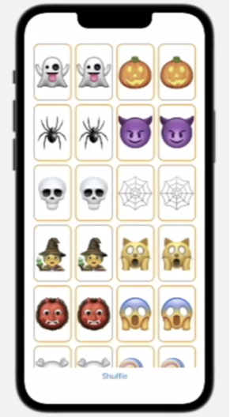

# Memorize

A memorize mobile game for iOS devices.

It's been developing through the Stanford CS193p - Developing Apps for iOS lectures.
Stanford's CS193p course, Developing Applications for iOS, explains the fundamentals of how to build applications for iPhone and iPad using SwiftUI.

You can find all the lectures and assignments by [this link](https://cs193p.sites.stanford.edu/).

